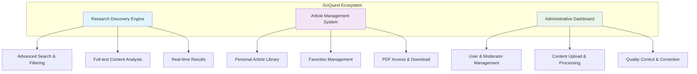
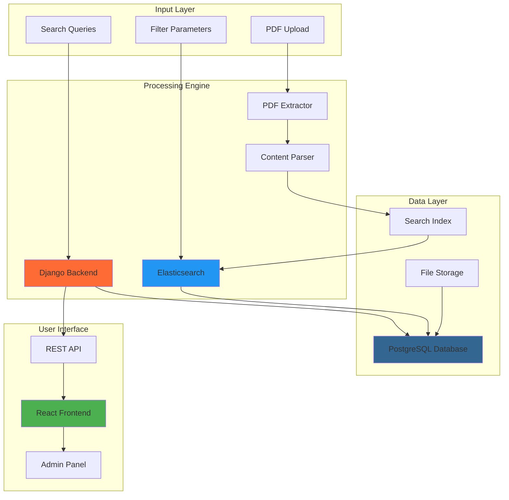
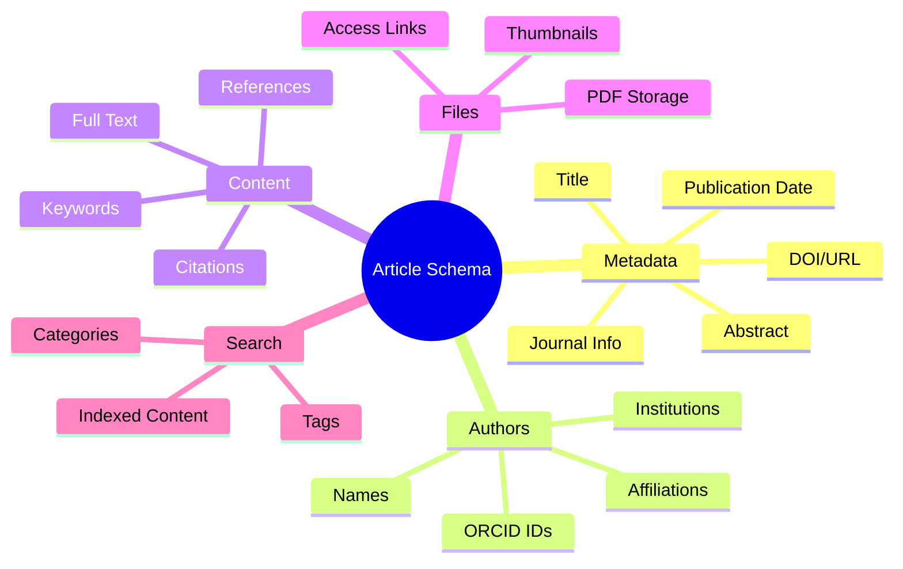
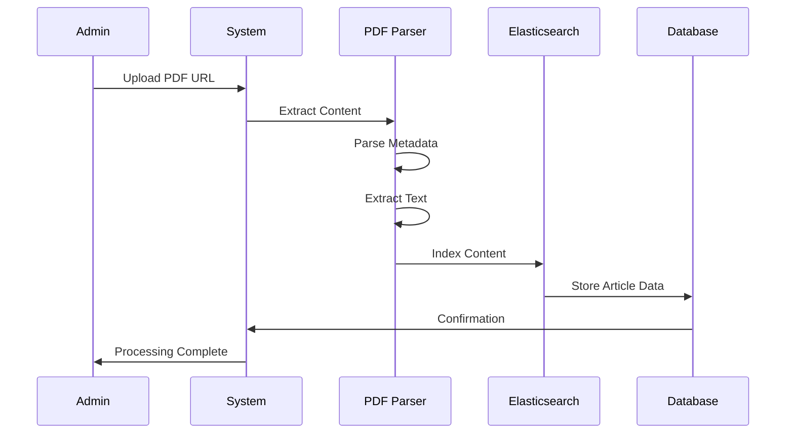
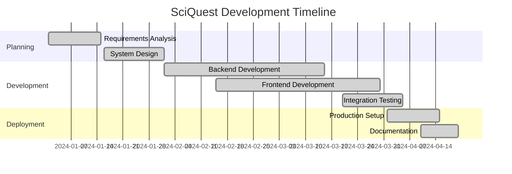

# SciQuest - Scientific Article Search Engine

**Advanced AI-powered research platform with intelligent article discovery and management**

[](https://python.org)
[](https://reactjs.org)
[](https://djangoproject.com)
[](https://elastic.co)
[](https://postgresql.org)
[](https://docker.com)

> A comprehensive scientific article search engine that streamlines research discovery and management through intelligent content extraction, advanced search algorithms, and intuitive user interfaces.

## Overview

SciQuest is a comprehensive scientific article search engine that streamlines the discovery and management of research papers. Built with modern web technologies, it provides researchers, academics, and students with powerful tools to efficiently access and organize scientific literature.

## Core Applications



| **User Interface** | **Admin Dashboard** |
|:---:|:---:|
| Advanced search capabilities | Content management system |
| Personal article collections | User and moderator controls |
| Real-time filtering | PDF processing pipeline |
| Intuitive result display | Quality assurance tools |

## Key Features

### For Users
- **Advanced Search**: Multi-criteria search by keywords, authors, titles, and full-text content
- **Smart Filtering**: Filter results by authors, institutions, keywords, and publication dates
- **Article Management**: Save favorite articles for quick access
- **Detailed Views**: Access full article metadata, abstracts, and PDF downloads
- **Chronological Results**: Latest articles displayed first

### For Administrators
- **User Management**: Add, remove, and manage moderators
- **Content Upload**: Bulk upload articles via PDF URLs
- **Automated Processing**: Intelligent PDF parsing and metadata extraction
- **Quality Control**: Review and correct extracted information
- **Search Optimization**: Elasticsearch-powered indexing for fast retrieval

## System Architecture



##  Technology Stack

| Component | Technology |
|-----------|------------|
| **Backend** | Python 3.8+, Django 4.0+, Django REST Framework |
| **Frontend** | React.js 18+, HTML5, CSS3, JavaScript ES6+ |
| **Database** | PostgreSQL |
| **Search Engine** | Elasticsearch 7.0+ |
| **Containerization** | Docker, Docker Compose |

## Article Data Structure



### Data Processing Pipeline



## Quick Start

### Using Docker (Recommended)

```bash
# Clone the repository
git clone <repository-url>
cd sciquest

# Start the application
docker-compose up --build

# Access SciQuest at http://127.0.0.1/
```

### Local Development Setup

#### Prerequisites
```bash
# System requirements
Python 3.8+
Node.js 16+
PostgreSQL 12+
Elasticsearch 7.0+
```

#### Backend Setup
```bash
cd backend

# Install dependencies
pip install -r requirements.txt

# Database migrations
python manage.py makemigrations extraction
python manage.py makemigrations authentication
python manage.py makemigrations app
python manage.py migrate

# Start Django server
python manage.py runserver
```

#### Frontend Setup
```bash
cd frontend

# Install packages
npm install

# Start React development server
npm start
```

### Application Access Points

| **Service** | **URL** | **Purpose** |
|:---:|:---:|:---:|
| **Frontend** | http://localhost:3000 | User interface |
| **Backend API** | http://localhost:8000 | REST API endpoints |
| **Admin Panel** | http://localhost:8000/admin | Django administration |
| **Production** | http://127.0.0.1/ | Docker deployment |

#### Stop Services
```bash
# Stop Docker containers
docker-compose down

# Or stop individual services
# Ctrl+C in respective terminals
```

## 📖 Documentation

### Project Resources
- [Project Drive](https://drive.google.com/drive/folders/15WRZnJ5oFkftp3iE-TuaKbINaSNraRAd?usp=drive_link)
- [Project Specification](https://drive.google.com/file/d/1rd_N4WBpBeo1aoOZal8GIqLncyMMgBiy/view?usp=sharing)
- [UI/UX Design (Figma)](https://www.figma.com/file/JwZGUrP2dFYvt9f0nSCkny/TP-IGL?type=design&node-id=0%3A1&mode=design&t=lOfRuItm6wMwmzIA-1)

### System Architecture
- [Components Diagram](https://lucid.app/lucidchart/b131bdbe-e753-481e-aa72-2c18ae8c7a63/edit?beaconFlowId=8FF84A62782E1FED&invitationId=inv_a2dc2edc-b15e-4f0c-9916-1873c72401d5&page=0_0#)
- [Class Diagram](https://lucid.app/lucidchart/475eb93d-7e6b-4042-a50e-92ac77c3fb59/edit?beaconFlowId=1A99DFD4D7FE81C7&invitationId=inv_894851c4-f9fe-4be1-ae7d-ad1f693bebc8&page=0_0#)
- [Database Schema](https://drawsql.app/teams/merys-team/diagrams/schema-bdd-tp-igl-23-24)

## Testing & Performance

### Testing Suite
```bash
# Backend tests
cd backend
python manage.py test

# Frontend tests
cd frontend
npm test
npm run test:coverage

# Integration tests
npm run test:e2e
```

### Performance Metrics

| **Metric** | **Development** | **Production** |
|:---:|:---:|:---:|
| **Search Response Time** | <200ms | <100ms |
| **Page Load Time** | <2s | <1s |
| **Concurrent Users** | 50+ | 500+ |
| **Database Queries** | Optimized | Cached |
| **Memory Usage** | ~500MB | ~1GB |

### Load Testing
```bash
# Performance testing with Apache Bench
ab -n 1000 -c 10 http://localhost:8000/api/search/

# Memory profiling
python -m memory_profiler manage.py runserver
```

## Contributing

1. Fork the repository
2. Create a feature branch (`git checkout -b feature/amazing-feature`)
3. Commit your changes (`git commit -m 'Add amazing feature'`)
4. Push to the branch (`git push origin feature/amazing-feature`)
5. Open a Pull Request


## Team & Project Information

- **Project**: SciQuest - Scientific Article Search Engine
- **Type**: Academic Software Engineering Project
- **Institution**: Higher School Of Computer Science
- **Course**: Software Engineering Laboratory (IGL)

### Project Timeline


## Support & Community

### Getting Help
- **Email**: ly_dinari@esi.dz
- **GitHub Issues**: [Create an issue](../../issues)
- **Documentation**: See the `/documentation` folder
- **Academic Support**: Contact your course instructor

### Contributing Guidelines
1. **Fork** the repository
2. **Create** a feature branch (`git checkout -b feature/amazing-feature`)
3. **Commit** your changes (`git commit -m 'Add amazing feature'`)
4. **Push** to the branch (`git push origin feature/amazing-feature`)
5. **Open** a Pull Request

### Code Style
```bash
# Python (Backend)
black backend/
flake8 backend/
pylint backend/

# JavaScript (Frontend)
npm run lint
npm run format
```


## Acknowledgments

**Powered by industry-leading frameworks:**
- **[Django](https://djangoproject.com/)** - Robust web framework
- **[React](https://reactjs.org/)** - Modern frontend library
- **[Elasticsearch](https://elastic.co/)** - Powerful search engine
- **[PostgreSQL](https://postgresql.org/)** - Reliable database system
- **[Docker](https://docker.com/)** - Containerization platform

## Version History

```mermaid
gitgraph
    commit id: "v1.0.0"
    commit id: "Core Search"
    branch feature/favorites
    commit id: "User Favorites"
    commit id: "UI Improvements"
    checkout main
    merge feature/favorites
    commit id: "v1.1.0"
    branch feature/elasticsearch
    commit id: "ES Integration"
    commit id: "Performance Boost"
    checkout main
    merge feature/elasticsearch
    commit id: "v1.2.0"
```

| **Version** | **Release Date** | **Key Features** |
|:---:|:---:|:---:|
| **v1.0.0** | 2024-01-15 | Initial release with core search functionality |
| **v1.1.0** | 2024-02-15 | Added user favorites and improved UI |
| **v1.2.0** | 2024-03-15 | Enhanced PDF processing and Elasticsearch integration |
| **v1.3.0** | 2024-04-15 | Advanced filtering and performance optimizations |

---

<p align="center">
  Made with ❤️ by the SciQuest Team
</p>
